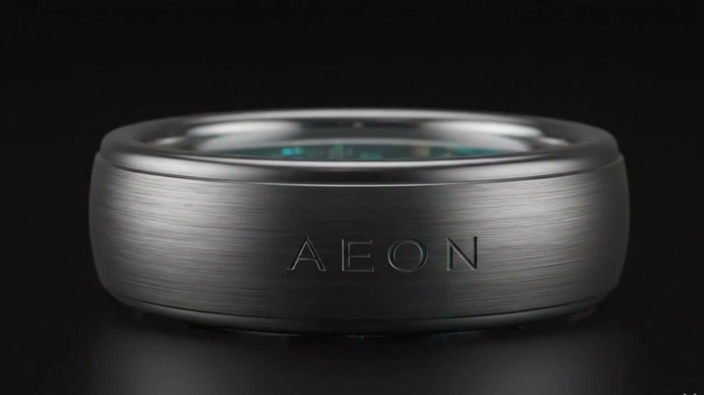

# AEON — Scroll-Driven Product Landing Page

> ⚠️ **Desktop Only** — This experience is optimized for desktop browsers. Mobile is not supported.

A premium, scroll-driven product landing page for **Aeon**, a digital ring concept. Built with pure HTML, CSS, and JavaScript — no frameworks, no build tools.



---

## 🖥️ Desktop Only

This project is intentionally designed for **desktop viewing only.**

| Device | Support |
|--------|---------|
| Desktop (Chrome, Edge, Firefox, Safari) | ✅ Fully supported |
| Tablet | ❌ Not supported |
| Mobile | ❌ Not supported |

---

## ✨ Features

- 🎞️ **Frame-by-frame scroll scrubbing** — 90 JPG frames play like a flipbook as you scroll
- ⏳ **Cinematic loading screen** — branded preloader with glowing cyan progress bar
- 💬 **Scroll-driven text overlays** — premium copy fades and slides in sync with frames
- 🪟 **Frosted glass CTA card** — `backdrop-filter` glass UI with cyan waitlist button
- 🔲 **Fixed navbar** — minimal navigation with logo, links, and pre-order CTA
- 🎬 **Vignette overlay** — cinematic edge darkening for a focused feel
- 📽️ **Film grain** — subtle animated noise texture for premium tactile aesthetic
- 🎯 **Smooth text transitions** — `cubic-bezier` slide-up + fade animations

---

## 🗂️ Project Structure

```
aeon/
├── public/
│   └── frames/
│       ├── ezgif-frame-001.jpg
│       ├── ezgif-frame-002.jpg
│       └── ... (90 frames total)
├── index.html
├── style.css
├── script.js
└── README.md
```

---

## 🛠️ Tech Stack

| Technology | Purpose |
|------------|---------|
| HTML5 Canvas | Frame-by-frame rendering |
| Vanilla JavaScript | Scroll logic, frame sequencing |
| CSS3 | Animations, vignette, grain, glass UI |
| GSAP + ScrollTrigger | Scroll timeline (via CDN) |
| Lenis | Smooth scrolling (via CDN) |
| Inter | Typography (via Google Fonts) |

---

## 🚀 How It Works

### Frame Sequencing
The source video was exported at 18fps and split into **90 JPG frames**. All frames preload into memory on page load. As the user scrolls, the scroll position (0–100%) maps to a frame index (0–89) and renders onto an HTML5 Canvas.

```javascript
const scrollFraction = scrollTop / maxScroll;
const frameIndex = Math.floor(scrollFraction * frameCount);
context.drawImage(images[frameIndex], 0, 0, canvas.width, canvas.height);
```

### Scroll Sections

The scroll container is `9000px` tall giving users comfortable dwell time on each section.

| Scroll % | Content |
|----------|---------|
| 0 – 20% | "Master Your Presence." |
| 30 – 50% | "Clarity, engineered." |
| 55 – 75% | "Your rhythm. Amplified." |
| 82 – 100% | Frosted glass CTA card |

---

## 🎨 Design Tokens

| Token | Value |
|-------|-------|
| Background | `#000000` |
| Accent | `#00F0FF` |
| Text | `#FFFFFF` |
| Muted | `rgba(255,255,255,0.5)` |
| Glass BG | `rgba(255,255,255,0.05)` |
| Glass Border | `rgba(255,255,255,0.1)` |
| Font | Inter 200, 300, 400 |

---

## ⚙️ Getting Started

No installations or build tools required.

```bash
# 1. Clone the repo
git clone https://github.com/yourusername/aeon.git
cd aeon

# 2. Serve locally (required — file:// won't load frames)
npx serve .

# Or with Python
python -m http.server 3000

# 3. Open in desktop browser
http://localhost:3000
```

> ⚠️ Must be served via a local server. Opening `index.html` directly via `file://` will cause frames to fail loading due to browser CORS policy.

---

## 📦 Re-extracting Frames

Frames were originally extracted using [ezgif.com](https://ezgif.com/video-to-jpg) at 18fps.

To re-extract via FFmpeg:

```bash
mkdir public/frames
ffmpeg -i your-video.mp4 -vf fps=15 -q:v 3 public/frames/ezgif-frame-%03d.jpg
```

---

## 🌐 Deployment

Static site — deploy anywhere:

```bash
# Vercel
npx vercel

# Netlify
# Drag and drop project folder at netlify.com

# GitHub Pages
# Push to repo → Settings → Pages → Deploy from branch
```

---

## 📸 How to Add Your Own Video

1. Export your video as MP4
2. Go to [ezgif.com/video-to-jpg](https://ezgif.com/video-to-jpg)
3. Upload → set FPS to 15–18 → Convert → Download ZIP
4. Extract frames into `public/frames/`
5. Update frame count in `script.js`:
```javascript
const frameCount = 90; // change to your frame count
```

---

## 🔮 Roadmap

- [ ] Cursor glow effect
- [ ] Scroll progress indicator
- [ ] Ambient audio synced to scroll
- [ ] Mouse parallax on canvas

---

## 📄 License

MIT — free to use, modify, and distribute.

---

*"Master Your Presence."*
